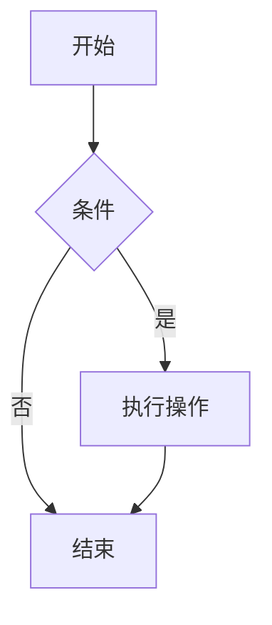

# 复杂 Markdown 示例文档

这个示例展示 Markdown 的多种功能，包括一些非标准扩展和可能不被所有解析器支持的特性。

## 1. 基础元素混合

### 1.1 复杂列表

- **项目列表** 包含多种元素：
  1. 嵌套编号列表项
  - [x] 任务列表 (GFM扩展)
  - [ ] 未完成任务
  > 列表内的引用块
  `行内代码`
  
- 第二项包含表格：

  | 对齐方式 | 示例 | 说明 |
  |:--------|:----:|------|
  | 左对齐  | 文本 | 使用`:---` |
  | 居中    | 文本 | 使用`:---:` |
  | 右对齐  | 文本 | 使用`---:` |

### 1.2 混合格式

这是**加粗**和*斜体*的组合：***加粗斜体***，还有~~删除线~~和<u>下划线</u>(非标准)。

行内数学公式(可能不支持)：`$E=mc^2$`

## 2. 高级特性

### 2.1 图表支持 (非标准扩展)

### 2.2 复杂表格

表格合并单元格 (GFM不支持):

| 合并列        || 正常列 |
|:-------------:|:------|-------|
| 跨两列        | 不适用 | 数据  |
| ^ 继续上一行 | 数据1 | 数据2 |

### 2.3 脚注[^1]

这是一个带脚注的示例[^2].

[^1]: 脚注本身是扩展语法
[^2]: 具体脚注内容

## 3. HTML混合

这是HTML块，在不支持HTML的渲染器中会显示为纯文本

## 4. 数学公式块 (可能不支持)

$$
\begin{aligned}
\nabla \times \vec{\mathbf{B}} -\, \frac{1}{c}\, \frac{\partial\vec{\mathbf{E}}}{\partial t} &= \frac{4\pi}{c}\vec{\mathbf{j}} \\
\nabla \cdot \vec{\mathbf{E}} &= 4 \pi \rho \\
\end{aligned}
$$

## 5. 特殊特性

### 5.1 注释 (原始Markdown不支持)

<!-- 这是注释，在渲染结果中不可见 -->

### 5.2 自定义属性 (非标准)

这是一个段落 {.class-name #id-name data-attr="value"} 但大多数解析器会忽略这些属性

## 6. 不支持的特性示例

1. **多列布局**：原生Markdown不支持
2. **交叉引用**：如"参见第[[章节]]"这样的引用
3. **变量替换**：如`{{变量名}}`
4. **条件内容**：根据条件显示不同内容
5. **嵌入式媒体**：如可交互的iframe
